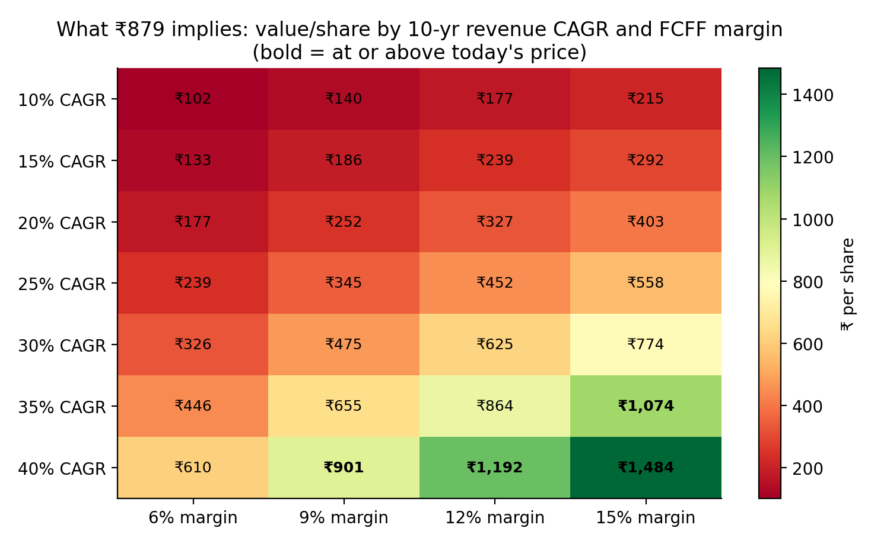

# CG Power & Industrial Solutions (NSE: CGPOWER) — Independent Equity Research

> Independent student research for learning purposes. Not investment advice.
> Author: Utkarsh Vaibhav · B.Tech ECE, SRM University · [LinkedIn](https://www.linkedin.com/in/utkarsh-vaibhav-76aa99300/)

## The question

CG Power trades at roughly 115x FY26 earnings. **What growth is the market pricing in, and is it realistic?**

## Key findings

- **Rating:** SELL · **Target price:** ₹402 (−54%) · **Price on valuation date:** ₹879 (NSE close, 1 Oct 2026)
- **What the price implies:** a reverse DCF at a 14.8% WACC shows ₹879 needs about **35% revenue CAGR for 10 years at a 12% free-cash-flow margin**. That means FY36 revenue of about ₹2.5 lakh Cr, 20x FY26 and 5.7x the combined FY26 revenue of ABB India, Siemens, Hitachi Energy India and GE Vernova T&D India. Even at an 11% WACC the price needs 25% a year for a decade. FY26 free cash flow was −₹72 Cr, and CG's best free-cash-flow margin in five years was 12.4% (FY23).
- **Valuation:** DCF ₹122 per share; peer multiples ₹682 (median 65x EV/EBITDA, 86x P/E). The target is a 50/50 blend. CG trades above even this expensive peer group (115x P/E against an 86x median), so it screens expensive on both methods. Every variant tested gives SELL: peer multiples on the latest 12 months to June 2026, or without Bharat Bijlee, still value CG at ₹730–733 (−17%).
- **Against the Street:** consensus is Outperform with an average target of ₹934 (20 analysts, MarketScreener, 1 Oct 2026). Kotak Institutional Equities is the main bear, at SELL with a ₹630 fair value. On our discount rate, ₹934 needs about 36% revenue CAGR for a decade at a 12% free-cash-flow margin. Our target sits below the Street low because of the DCF; our peer-multiple value (₹682) is close to Kotak's.
- **Bull case:** order backlog of ₹18,965 Cr at 30 Jun 2026 (+45% YoY, ~1.5x FY26 revenue); Power Systems revenue +46% in FY26 and +31% in Q1 FY27 at a 24% EBITDA margin, with a ₹900 Cr US data-centre transformer order in hand.
- **Bear case:** trade receivables grew 46% against revenue growth of 25% in FY26, so operating cash flow was only 43% of EBITDA. Industrial Systems grew just 6% in FY26 and again in Q1 FY27. The semiconductor business cost ₹111 Cr in FY26 and ₹43 Cr (132 bps of margin) in Q1 FY27 alone. Q1 FY27 revenue growth slowed to 14% with a 12.1% EBITDA margin.
- **Commodity angle:** a 10% rise in copper prices cuts EBITDA margin by about 94 bps (about 7% of FY27E EBITDA) at 50% pass-through. Raw material is 69% of revenue (FY26 annual report). Copper (27%) and electrical steel (24%) shares of material cost are built from IEEMA's published price-variation weights for transformers and motors, weighted by an estimated business mix (CG does not disclose sub-segment revenue). Commodity costs were one reason Industrial Systems' EBITDA margin fell from 12.8% to 10.6% in FY26 and to 9.6% in Q1 FY27.



## What's in this repo

| File | What it is |
|---|---|
| `model/CGPower_Research_Model.xlsx` | The full model: historicals, forecast, DCF, reverse DCF, peer comps, commodity sensitivity |
| `cgpower_analysis.py` | Re-builds the valuation independently in Python, checks it against Excel, and draws the charts |
| `charts/` | Charts used in the report |
| `report/CGPower_Initiating_Coverage.pdf` | Initiating-coverage report (7 pages); HTML source alongside |
| `report/CGPower_One_Page_Pitch.pdf` | One-page stock pitch; HTML source alongside |

## Method

1. **Historicals (FY22–FY26):** consolidated P&L, balance sheet, cash flow and efficiency ratios, with check rows that tie back to reported figures.
2. **Forecast (FY27E–FY31E):** revenue built up by segment (Power Systems, Industrial Systems, Semiconductors), then margin, D&A, capex and working-capital drivers down to free cash flow to the firm (FCFF).
3. **DCF (3-stage):** 5 explicit years, 5 years where growth fades linearly to terminal growth, then a Gordon-growth terminal value. WACC from CAPM. Includes a WACC × terminal-growth sensitivity table.
4. **Reverse DCF:** value per share for a grid of 10-year revenue CAGRs (10–40%) and FCFF margins (6–15%), to show which combinations justify today's price.
5. **Peer comps:** ABB India, Siemens, Hitachi Energy India, GE Vernova T&D India and Bharat Bijlee on P/E and EV/EBITDA. FY26 is the same 12 months (Apr-2025 to Mar-2026) for every company, and one-off gains are excluded.
6. **Commodity sensitivity:** EBITDA-margin impact of copper and electrical-steel price moves after partial price pass-through. Copper and steel shares come from IEEMA's price-variation formulas for power transformers (copper 32, CRGO 27 of 84 material points) and LT motors (copper 26, electrical steel 27 of 82), blended by business mix on the Commodity sheet.

Colour convention in the workbook: blue = input, black = formula, green = link to another sheet, yellow = key assumption.

## What checking the inputs changed

Each placeholder was checked against a primary source before the rating was set, and the forecast was re-checked against the June 2026 quarter. These checks moved the answer:

| Input | Placeholder | Verified | Source and effect |
|---|---|---|---|
| Cash & investments | ₹3,000 Cr | ₹4,341 Cr | FY26 annual report: ₹2,928 Cr of fixed deposits (₹2,591 Cr of them QIP money) sit under "other financial assets", outside the cash line |
| Working capital | 70 days (19% of revenue) | 24 days (6.7%) | Screener's 70 days counts ₹1,580 Cr of fixed deposits (mostly QIP money); operating working capital from the annual report is 24 days. DCF rose from ₹108 to ₹128 |
| Risk-free rate, beta | 6.5%, 1.0 | 7.21%, 1.26 | 10-yr G-sec at a two-year high on 1 Oct 2026; 2-year weekly beta vs Nifty 50 is 1.39 raw, 1.26 adjusted. WACC rose from 12.5% to 14.8% |
| Peer earnings | (blank) | Apr-25 to Mar-26, one-offs excluded | ABB India's ₹1,442 Cr one-off gain falls inside FY26 and is excluded; Siemens' ₹1,800 Cr gain (Jun-26 quarter) falls outside it. Reported trailing profits would have roughly halved both P/Es |
| Industrial Systems growth | 12% a year | 7% FY27E, then 8% | Segment grew 6% in FY26 and 6% in Q1 FY27 (motors double digit, railways flat) |
| FY27E EBITDA margin | 13.5% | 13.0% | Q1 FY27 was 12.1% (12.7% before a ₹20 Cr railway provision). With the growth cut, DCF fell from ₹128 to ₹122 |
| Copper, steel share of material | 20%, 15% | 27%, 24% | IEEMA price-variation weights × business mix. A 10% copper rise now costs 94 bps of margin, not 69 bps |

The Cover sheet of the workbook records the status of each pre-presentation check.

## How to run the checks

```bash
pip install -r requirements.txt
python cgpower_analysis.py model/CGPower_Research_Model.xlsx
```

After editing the workbook, open and save it in Excel first so formula values are up to date. The script prints PASS/FAIL for each check and saves charts to `charts/`. Last run (4 Oct 2026): all 5 checks pass.

## Sources

- Screener.in, CG Power and peer financials (C-MOTS data), accessed 30 Sep and 4 Oct 2026
- CG Power FY26 annual report (BSE filing): consolidated balance sheet and notes 7, 11, 13–15 and 56
- CG Power Q4 FY26 press release and earnings call transcript (May 2026); Q1 FY27 press release (24 Jul 2026)
- IEEMA price-variation circulars for power and distribution transformers (Nov 2021) and rotating machines (Nov 2022)
- MarketScreener analyst consensus (1 Oct 2026); Kotak Securities summary of KIE's Q1 FY27 update (27 Jul 2026)
- Yahoo Finance weekly prices (CGPOWER.NS, ^NSEI) for beta; Trading Economics for the 10-year G-sec yield
- Full links are on the Cover sheet of the workbook
